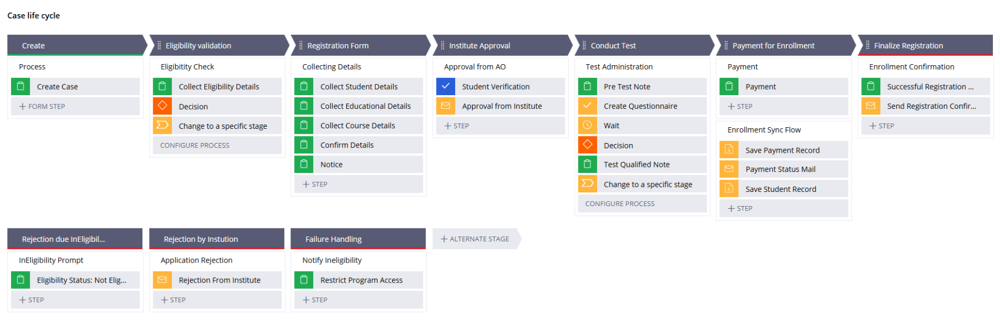

# Student Registration Application — Pega Community Edition

[](https://community.pega.com/)
[]()
[]()
[]()

A low-code, enterprise case-management application built on **Pega Community Edition** for the **University Academic Program (UAP)** under TalentSprint / TSP. 

This repository serves as a **portfolio and technical documentation archive** for the project. It includes the exported Pega application bundle (`.zip`), end-to-end workflow walkthrough screenshots, architectural details, and import instructions.

---

## Table of Contents

- [Project Overview](#project-overview)
- [Problem Statement](#problem-statement)
- [Initial Baseline Use Case vs. Advanced Implementation](#initial-baseline-use-case-vs-advanced-implementation)
- [Key Features & Enhancements](#key-features--enhancements)
- [Application Architecture](#application-architecture)
- [Case Lifecycle](#case-lifecycle)
- [Workflow Walkthrough & Demo](#workflow-walkthrough--demo)
- [Pega Application Package](#pega-application-package)
- [How to Import into Pega](#how-to-import-into-pega)
- [Repository Structure](#repository-structure)
- [Project Presentation](#project-presentation)
- [Limitations & Scope Boundaries](#limitations--scope-boundaries)
- [Academic Context & Credits](#academic-context--credits)

---

## Project Overview

The **Student Registration Application (`TSPP`)** automates the end-to-end onboarding and enrollment process for university students seeking admission into the University Academic Program (UAP). 

Starting from initial eligibility qualification to dynamic institutional review, interactive online testing, course fee payment, and final enrollment confirmation, the application manages the student journey using **Pega's Case Management and Workflow Automation** capabilities.

### Technical Metadata

| Attribute | Details |
| :--- | :--- |
| **Application Name** | `TSPP` |
| **Application Version** | `01.01.01` |
| **Organization (Org / Div / Unit)** | `TSPO` / `Div` / `Unit` |
| **Class Structure** | `TSPO-FW-TSPP-Work` |
| **Parent Case Type** | `StudentRegistration` (`TSPO-FW-TSPP-Work-StudentRegistration`, Prefix: `S-`) |
| **Child Case Type** | `EligibilityTest` (`TSPO-FW-TSPP-Work-EligibilityTest`, Prefix: `E-`) |
| **Platform Version** | Pega Community Edition / Platform '24 (Engine: `8.24.52`) |
| **Built-On Application** | Constellation UI Architecture (`01.01`) |

---

## Problem Statement

Partner institutions affiliated with the University Academic Program (UAP) previously handled student registration manually. This manual process suffered from:
- **Time Inefficiency:** Delayed verification of student academic eligibility and active backlogs.
- **Decentralized Data:** Student records, uploaded grade memos, and course choices were scattered across unlinked spreadsheets and emails.
- **Lack of Governance:** Approval delays occurred without Service Level Agreements (SLAs), leaving student applications unmonitored.
- **Fragmented Evaluation:** Pre-enrollment testing and fee collection were decoupled from the initial application submission.

The goal was to build a centralized, automated Pega application to streamline student intake, enforce institutional eligibility rules, route cases to college officers, score assessments in real-time, and process payments.

---

## Initial Baseline Use Case vs. Advanced Implementation

The project originated from an introductory baseline specification provided during initial training: [**`Student Registration to UAP-R.pdf`**](docs/initial-use-case/Student%20Registration%20to%20UAP-R.pdf) (`UC-21`, 6-hour introductory scope).

While that document described a rudimentary, single-screen form with email notification, the **actual implemented application was significantly re-architected into an advanced, enterprise-grade multi-stage case management system**.

Below is an objective comparison between the initial baseline documentation and the advanced system actually engineered in Pega:

| Functional Area | Initial Baseline Use Case (`UC-21`) | Advanced Implementation in Pega (`TSPP`) | Evolution |
| :--- | :--- | :--- | :--- |
| **Case Lifecycle** | Single-form collection with email confirmation step. | Full 7-stage enterprise lifecycle with status transitions. | **Significantly Expanded** |
| **Eligibility Gate** | Conceptual precondition statement. | Dedicated `EligibilityCheck` stage validating affiliation, semester (3rd/4th year), and active backlogs upfront. | **Implemented & Automated** |
| **Address Cascading** | Country $\rightarrow$ State $\rightarrow$ City dropdowns; ZIP code lookup. | Dynamic cascading dropdowns populated from data tables; auto-populates Location and Landmark on ZIP tab-out. | **Fully Implemented** |
| **Educational Details** | Basic percentages input (SSC, Intermediate, B.Tech). | Institution and semester tracking, percentage validation, and document upload attachments for certificates/memos. | **Enhanced with File Uploads** |
| **Course Selection** | Not specified in original use case. | Dynamic course selection (e.g., *Certified Pega Senior System Architect*) with fee (₹17,500) and duration (3 Months). | **Custom Enhancement** |
| **Approvals & Routing** | No approval stage defined. | Dedicated `InstituteApproval` stage dynamically routed to the Academic Officer of the student's institute (e.g., `AO@ACE`). | **Custom Enhancement** |
| **SLA Enforcement** | Not specified in original use case. | 2-Day Service Level Agreement with automated escalation/rejection if the institute fails to review. | **Custom Enhancement** |
| **Assessment / Exam** | Not specified in original use case. | Sub-case `EligibilityTest` (`E-`) with 5 low-code questions, automated scoring ($\ge 30/50$ pass mark), and parent case update. | **Custom Enhancement** |
| **Payment Processing** | Not specified in original use case. | `EnrollmentPayment` stage supporting UPI and Card payments with input validation and savable data pages. | **Custom Enhancement** |
| **Case ID & Payment ID** | Generic default ID. | Standardized compound identifier combining Case ID and Roll Number (`S-XXXX-STU-XXXXX`). | **Custom Enhancement** |
| **Modified Logout Screen** | Specified in UC-21 flow (Step 10). | Not implemented; standard portal behavior preserved. | **Omitted / Out of Scope** |
| **Email Domain Filtering** | Planned in notes (blocking `@gmail.com`). | Not enforced in the final validation rules (allows standard email domains). | **Relaxed for Testing** |

---

## Key Features & Enhancements

### 1. Multi-Stage Case Lifecycle Management
Unlike basic single-step forms, the application is divided into 7 distinct stages with formal status management (`NEW` $\rightarrow$ `PENDING-ELIGIBILITY CHECK` $\rightarrow$ `PENDING-REGISTRATION` $\rightarrow$ `PENDING-APPROVAL` $\rightarrow$ `PENDING-TEST` $\rightarrow$ `PENDING-PAYMENT` $\rightarrow$ `REGISTRATION-COMPLETE` $\rightarrow$ `RESOLVED-COMPLETED`).

### 2. Cascading Data Architecture & ZIP Code Lookup
- **Cascading Dropdowns:** Selecting a Country filters available States; selecting a State filters available Cities.
- **Data Lookup:** Tab-out on the ZIP code field triggers a data lookup against `TSPO-FW-TSPP-Data-LocationAndLandmark`, automatically populating the `Location` and `Landmark` fields without manual user entry.

### 3. Dynamic Institutional Routing & SLA
- When a student selects their affiliated institution (e.g., *Aditya Engineering College*), the case automatically routes to the designated Academic Officer work queue/operator (`AO@ACE`).
- A **2-Day Service Level Agreement (SLA)** monitors the review assignment. If the Academic Officer does not act within 2 days, the application triggers an automated rejection process.

### 4. Child Case Architecture for Assessment (`EligibilityTest`)
- The assessment is decoupled from the main registration flow into an independent sub-case type (`TSPO-FW-TSPP-Work-EligibilityTest`, prefix `E-`).
- A Pega **Wait Shape** pauses the parent `StudentRegistration` case until the child case completes.
- **Rule-Obj-When** rules evaluate student answers against key benchmarks, and a Data Transform (`CalculateScore`) computes total points and writes back to `pyWorkCover.Score`.
- A **Decision Shape** in the parent flow routes the student to payment if `Score >= 30` or triggers an ineligibility exit if failed.

### 5. Multi-Mode Payment & Savable Data Pages
- Course fees are dynamically inherited from the selected course.
- Supports payment modes (UPI and Credit/Debit Card) with format validations (Roll Number pattern `STU-XXXXX`, UPI ID pattern, and card CVV/number checks).
- Utilizes savable data pages and Data Transforms (`GeneratePaymentID`, `SPDT`) to store transaction logs into `TSPO-FW-TSPP-Data-PaymentDetails`.

---

## Application Architecture

```
TSPO (Organization)
 └── TSPO-FW-TSPP (Framework)
      ├── TSPO-FW-TSPP-Work (Work Pool)
      │    ├── TSPO-FW-TSPP-Work-StudentRegistration (Parent Case: S-)
      │    └── TSPO-FW-TSPP-Work-EligibilityTest    (Child Case: E-)
      └── TSPO-FW-TSPP-Data (Data Pool)
           ├── ...-Data-StudentsInformation
           ├── ...-Data-LocationDataSet
           ├── ...-Data-LocationAndLandmark
           ├── ...-Data-CollegeLocation
           └── ...-Data-PaymentDetails
```

---

## Case Lifecycle

The application architecture features **7 Primary Stages** and **3 Alternate Stages** for automated exception handling and rejection paths, as configured in the Pega Case Life Cycle Designer:



### Primary Stages & Processes

1. **Create (`CaseCreation`)**
   * **Process:** `Process`
   * **Steps:** `Create Case` (invoking `CreateForm_Default` to initialize case properties).
2. **Eligibility validation (`EligibilityCheck`)**
   * **Process:** `Eligibility Check`
   * **Steps:** `Collect Eligibility Details` $\rightarrow$ `Decision` $\rightarrow$ `Change to a specific stage`
   * **Routing:** Directs ineligible candidates (unaffiliated college, non-3rd/4th year, or active backlogs) to the `Rejection due InEligibility` alternate stage.
3. **Registration Form (`StudentRegistration`)**
   * **Process:** `Collecting Details`
   * **Steps:** `Collect Student Details` $\rightarrow$ `Collect Educational Details` $\rightarrow$ `Collect Course Details` $\rightarrow$ `Confirm Details` $\rightarrow$ `Notice`
   * **Features:** Personal info collection, cascading address dropdowns with automated ZIP lookup, academic qualifications with certificate file attachments, dynamic course fee/duration calculations, consolidated review screen, and 2-day verification SLA notice.
4. **Institute Approval (`InstituteApproval`)**
   * **Process:** `Approval from AO`
   * **Steps:** `Student Verification` (Approve / Reject decision) $\rightarrow$ `Approval from Institute` (Automated email correspondence)
   * **Routing & Governance:** Dynamically routes assignments to the Academic Officer operator (`AO@ACE`) based on the selected institute, governed by a 2-day SLA deadline.
5. **Conduct Test (`EligibilityTest`)**
   * **Process:** `Test Administration`
   * **Steps:** `Pre Test Note` $\rightarrow$ `Create Questionnaire` (spins off child case `E-1`) $\rightarrow$ `Wait` (Wait Shape) $\rightarrow$ `Decision` $\rightarrow$ `Test Qualified Note` $\rightarrow$ `Change to a specific stage`
   * **Scoring:** Child case calculates total score via When rules (`C1`–`C5`) and Data Transform `CalculateScore` writing to `pyWorkCover.Score`. A Decision Shape requires $\ge 30/50$ points to advance.
6. **Payment for Enrollment (`EnrollmentPayment`)**
   * **Process 1:** `Payment` $\rightarrow$ `Payment` step (UPI / Credit Card mode selection and input validation).
   * **Process 2:** `Enrollment Sync Flow` $\rightarrow$ `Save Payment Record` (Savable Data Page) $\rightarrow$ `Payment Status Mail` (Email correspondence) $\rightarrow$ `Save Student Record` (Savable Data Page).
7. **Finalize Registration (`RegistrationConfirmation`)**
   * **Process:** `Enrollment Confirmation`
   * **Steps:** `Successful Registration ...` (Congratulatory success screen) $\rightarrow$ `Send Registration Confirmation` (Official onboarding email).
   * **Resolution:** Case reaches completion with status `RESOLVED-COMPLETED`.

### Alternate Stages (Exception & Rejection Paths)

* 🔴 **Rejection due to Ineligibility (`Rejection due InEligibility`):**
  * **Process:** `InEligibility Prompt`
  * **Step:** `Eligibility Status: Not Eligible`
  * **Trigger:** Invoked if the applicant reports active backlogs or an unaffiliated college during Stage 2.
* 🔴 **Rejection by Institution (`Rejection by Instution`):**
  * **Process:** `Application Rejection`
  * **Step:** `Rejection From Institute` (Automated rejection correspondence)
  * **Trigger:** Invoked if the college Academic Officer selects `Reject` or if the 2-day verification SLA deadline expires.
* 🔴 **Failure Handling (`Failure Handling`):**
  * **Process:** `Notify Ineligibility`
  * **Step:** `Restrict Program Access`
  * **Trigger:** Invoked if the applicant scores below the 30-point passing threshold on the entrance assessment.

---

## Workflow Walkthrough & Demo

The following visual walkthrough documents the live, end-to-end execution of Case **`S-3`** across all 7 stages of the case lifecycle, with descriptions and technical details below each screenshot:

---

### Step 01: Case Creation Modal

* **Workflow Stage:** Stage 1 — `CaseCreation`
* **Work Status:** `NEW`
* **Description:** Initiates the `Student Registration` case (`S-3`). Prompts the applicant or operator with a modal displaying the case label and welcome description (*"Welcome to Student registration Application for University Academic program (UAP)"*).
* **Pega Technical Details:** Invokes the `CreateForm_Default` flow and initial data transforms (`pyDefault`, `pySetFieldDefaults`) to initialize case properties and default urgency.

---

### Step 02: Eligibility Check Gateway (`collectEligibilityDetails`)

* **Workflow Stage:** Stage 2 — `EligibilityCheck`
* **Work Status:** `PENDING-ELIGIBILITY CHECK`
* **Description:** Acts as a pre-registration eligibility gatekeeper. Verifies whether the student's college is affiliated with UAP, allows selection of the State and affiliated Institute, confirms current academic standing (3rd or 4th year / semesters 5th–8th), and checks that the applicant has no active backlogs.
* **Pega Technical Details:** If an applicant indicates active backlogs or an unaffiliated college, business rules immediately halt registration and transition the case to an ineligibility exit.

---

### Step 03: Student Personal & Address Details (`collectStudentPersonalDetails`)

* **Workflow Stage:** Stage 3 — `StudentRegistration` (Step 1)
* **Work Status:** `PENDING-REGISTRATION`
* **Description:** Collects core student identity fields including First Name, Last Name, Gender, Roll Number (`STU-12345`), Phone Number (+91 format), and Email address. Features a dynamic cascading address interface (`Country` -> `State` -> `City` -> `Zipcode`). When the student enters ZIP code `522020` and tabs out, Pega automatically retrieves and populates the Location (*Gundunagar*) and Landmark (*Near Temple*) fields.
* **Pega Technical Details:** Implements Edit Validate rules on Roll Number (`STU-XXXXX` regex pattern) and invokes data pages sourcing from `TSPO-FW-TSPP-Data-LocationAndLandmark` on ZIP tab-out.

---

### Step 04: Educational Qualifications & Document Uploads (`collectEducationalDetails`)

* **Workflow Stage:** Stage 3 — `StudentRegistration` (Step 2)
* **Work Status:** `PENDING-REGISTRATION`
* **Description:** Gathers prior academic track records. Displays the student's enrolled institute (*Aditya Engineering College*) and current semester (*7th*) as read-only context. Collects academic percentages for SSC (10th), Intermediate (12th), and Graduation (B.Tech). Integrates file attachment controls allowing students to upload digital copies of their SSC Certificate, Intermediate Certificate, and Graduation Grade Memo.
* **Pega Technical Details:** Configured with property validations (`CollectEducationalDetails`) enforcing percentage thresholds and multi-file attachment associations linked directly to the case work object.

---

### Step 05: Course Selection & Dynamic Pricing (`collectCourseDetails`)

* **Workflow Stage:** Stage 3 — `StudentRegistration` (Step 3)
* **Work Status:** `PENDING-REGISTRATION`
* **Description:** Enables the applicant to choose their desired certification specialization (e.g., *Certified Pega Senior System Architect*). Upon selection, the application dynamically displays the associated Course Fee (*₹17,500*) and Course Duration (*3 Months*).
* **Pega Technical Details:** Utilizes dynamic field behavior and data transform rules to calculate and populate fee parameters directly into the case data model.

---

### Step 06: Consolidated Application Review (`confirmStudentDetails`)

* **Workflow Stage:** Stage 3 — `StudentRegistration` (Step 4)
* **Work Status:** `PENDING-REGISTRATION`
* **Description:** Provides a complete read-only summary screen consolidating all previously entered information—Personal Information, Address Data, Academic Percentages, Uploaded Documents, and Selected Course Details—giving the applicant a comprehensive review prior to submitting.
* **Pega Technical Details:** Uses structured layout sections referencing the student data model to render a unified verification view without redundant database queries.

---

### Step 07: Institute Verification & SLA Policy Notice (`displayMessage`)

* **Workflow Stage:** Stage 3 — `StudentRegistration` (Step 5)
* **Work Status:** `PENDING-APPROVAL`
* **Description:** Advises the applicant that their application has been successfully captured and routed to their institute authority for verification. Crucially communicates the Service Level Agreement (SLA) policy: verification must be completed within 2 days, after which the application is automatically rejected.
* **Pega Technical Details:** Updates work status to `PENDING-APPROVAL` and initiates the background Service Level Agreement timer governing the subsequent approval stage.

---

### Step 08: Dynamic Routing & Work Queue Assignment

* **Workflow Stage:** Stage 4 — `InstituteApproval`
* **Work Status:** `PENDING-APPROVAL`
* **Description:** Demonstrates Pega's dynamic assignment routing. Based on the college selected by the student (*Aditya Engineering College*), the case assignment `Get Approval` is routed specifically to that institution's Academic Officer work queue/operator (`AO@ACE`, Urgency: 10).
* **Pega Technical Details:** Uses dynamic routing logic referencing `CollegeLocation` data tables to route assignments to institutional operator IDs rather than static user queues.

---

### Step 09: Academic Officer Review & Approval Decision (`Get Approval`)

* **Workflow Stage:** Stage 4 — `InstituteApproval`
* **Work Status:** `PENDING-APPROVAL`
* **Description:** The Academic Officer portal screen where college authorities review the student's credentials, certificates, and course request. The officer evaluates the application and can either click `Approve` to advance the case or `Reject` to route to an application rejection stage.
* **Pega Technical Details:** Flow action decision step that evaluates decision branching (`Approve` transitions to `EligibilityTest`; `Reject` transitions to `ApplicationRejection`).

---

### Step 10: Pre-Assessment Instructions (`preTestNote`)

* **Workflow Stage:** Stage 5 — `EligibilityTest` (Pre-Test Step)
* **Work Status:** `PENDING-TEST`
* **Description:** Following institutional approval, the student receives notice that institute verification succeeded, accompanied by detailed rules for the mandatory eligibility test (5 questions, 10 points each, 30 passing score threshold, 0 points for unanswered/incorrect answers).
* **Pega Technical Details:** Informs the user before spinning off the assessment sub-case, preparing the parent case to enter an awaiting state.

---

### Step 11: Online Eligibility Assessment Child Case (`Question page` - Case `E-1`)

* **Workflow Stage:** Stage 5 — `EligibilityTest` (Child Case Execution)
* **Work Status:** `NEW` (Child Case `E-1`)
* **Description:** Demonstrates Pega parent/child case architecture. The parent case spins off a child case `EligibilityTest` (`E-1`) and enters a Wait Shape. The child case presents an interactive 5-question low-code assessment on BPM concepts, CRM cases, low-code agility, process models, and sales leads.
* **Pega Technical Details:** Child case `TSPO-FW-TSPP-Work-EligibilityTest` executes its `Questionnaire` stage while the parent case `StudentRegistration` remains in a synchronized Wait Shape (`waitForTestCompletion`).

---

### Step 12: Automated Scoring Feedback & Qualification (`displayTestQualifiedNote`)

* **Workflow Stage:** Stage 5 — `EligibilityTest` (Evaluation & Results)
* **Work Status:** `PENDING-TEST`
* **Description:** Upon completion of the child case, automated evaluation rules calculate the score and return it to the parent case. The screen displays a celebratory clearance notice showing the final score (*50/50*) and authorization to proceed to payment.
* **Pega Technical Details:** Evaluated using When rules (`C1` through `C5`) and Data Transform `CalculateScore`, which maps the score to `pyWorkCover.Score`. A Decision Shape evaluates `Score >= 30` before presenting the clearance view.

---

### Step 13: Enrollment Fee Payment Processing (`processPaymentStep`)

* **Workflow Stage:** Stage 6 — `EnrollmentPayment`
* **Work Status:** `PENDING-PAYMENT`
* **Description:** Handles course enrollment fee collection. Displays the inherited fee (*₹17,500*), lets the student choose between UPI and Credit/Debit Card modes, and validates payment inputs (UPI ID regex e.g. `1234567890@gpay` and Card CVV/Number).
* **Pega Technical Details:** Executes savable data pages and Data Transforms (`GeneratePaymentID`, `SPDT`) to generate compound payment references (`S-3-STU-12345`) and commit records to `TSPO-FW-TSPP-Data-PaymentDetails`.

---

### Step 14: Registration Success & Onboarding Notice (`displayRegistrationSuccessNote`)

* **Workflow Stage:** Stage 7 — `RegistrationConfirmation`
* **Work Status:** `REGISTRATION-COMPLETE`
* **Description:** Final confirmation screen notifying the student that their registration and payment for the University Academic Program under TSPP has been completed successfully. Outlines subsequent onboarding schedules and orientation materials dispatched to their registered email.
* **Pega Technical Details:** Transitions case work status to `REGISTRATION-COMPLETE` and triggers correspondence automation.

---

### Step 15: Resolved Case Lifecycle

* **Workflow Stage:** Case Completion
* **Work Status:** `RESOLVED-COMPLETED`
* **Description:** Displays the fully completed case lifecycle with all 7 stages marked with green checkmarks (`CaseCreation`, `EligibilityCheck`, `StudentRegistration`, `InstituteApproval`, `EligibilityTest`, `EnrollmentPayment`, and `RegistrationConfirmation`), with work status formally set to `RESOLVED-COMPLETED`.
* **Pega Technical Details:** Final resolution step setting standard Pega resolution status (`Resolved-Completed`) and closing open work assignments.

---

## Pega Application Package

The downloadable Pega application package is archived under:
```
application/StudentRegistrationToUAP.zip
```

### Archive Package Contents
The ZIP file contains a complete Pega Application Bundle export:
- `Application.xml` — Defines product rules and import order.
- `StudentRegistrationToUAP_rules.jar` — Rule-Application, Rule-Obj-Class, Case Types, Flows, Views, Data Transforms, Decision Rules, SLAs, and Data Pages.
- `StudentRegistrationToUAP_schema.jar` — Database table schemas and data class definitions.
- `StudentRegistrationToUAP_dbconfig.jar` — Database configuration entries.
- `application.properties` & `META-INF/MANIFEST.MF` — Build manifest metadata.

---

## How to Import into Pega

To import and run this application in your local or hosted Pega environment:

1. **Access Pega Platform:**
   Log into your **Pega Community Edition** or Pega Platform instance with Administrator credentials.
2. **Open the Import Wizard:**
   In Dev Studio, navigate to the header menu:
   $$\text{Configure} \longrightarrow \text{Application} \longrightarrow \text{Distribution} \longrightarrow \text{Import}$$
3. **Upload the ZIP File:**
   Click **Choose File**, select `application/StudentRegistrationToUAP.zip`, and click **Next**.
4. **Process Schema & Rules:**
   - Follow the wizard prompts to import database tables (`schema.jar`).
   - Import application rulesets (`TSPP`, `TSPPInt`, `TSPO`, `TSPOInt`).
   - If prompted for existing schema updates, review and accept.
5. **Switch Application:**
   Once the import is complete, click the application menu in the Dev Studio header and switch to **`TSPP 01.01.01`**.
6. **Create a Case:**
   Navigate to **+ Create $\longrightarrow$ Student Registration** to run the workflow.

---

## Repository Structure

```
├── README.md                                 # Main project documentation & portfolio overview
├── application/
│   └── StudentRegistrationToUAP.zip          # Exported Pega application bundle (download & import)
├── docs/
│   ├── case-lifecycle.png                    # Pega Case Lifecycle Designer diagram
│   ├── demo/                                 # Sequenced workflow screenshots demonstrating Case S-3
│   │   ├── 01_case_creation_modal.png
│   │   ├── 02_eligibility_check.png
│   │   ├── 03_personal_and_address_info.png
│   │   ├── 04_educational_details.png
│   │   ├── 05_course_selection.png
│   │   ├── 06_confirm_student_details.png
│   │   ├── 07_sla_verification_notice.png
│   │   ├── 08_institute_approval_assignment.png
│   │   ├── 09_academic_officer_approval.png
│   │   ├── 10_pre_test_instructions.png
│   │   ├── 11_eligibility_questionnaire_test.png
│   │   ├── 12_test_results_qualified.png
│   │   ├── 13_enrollment_fee_payment.png
│   │   ├── 14_registration_success_confirmation.png
│   │   └── 15_case_resolved_completed.png
│   └── initial-use-case/                     # Original baseline training reference document
│       └── Student Registration to UAP-R.pdf
└── presentation/
    └── Student Registration PPT.pptx         # Academic presentation deck
```

---

## Project Presentation

The complete slide deck presented for academic review is available in the repository:
- 📄 **Presentation File:** [`presentation/Student Registration PPT.pptx`](presentation/Student%20Registration%20PPT.pptx)

### Slide Deck Highlights
1. **Title & Team Cosmos:** Presented by Koneti Sairam Avinash, Pakalapati Varshini, and Nallani Adharsh.
2. **Problem Statement:** Challenges in manual registration, decentralized data, and verification delays across partnered colleges for UAP.
3. **Challenges & Bottlenecks:** Time-consuming manual tracking, lack of centralized oversight, communication gaps.
4. **Proposed Solution:** Centralized, low-code Pega workflow with automated eligibility criteria, SLA governance, and seamless student onboarding.
5. **Pega Platform Concepts Covered:** Case Management, Workflow Automation, Data Models & Data Pages, Declarative Rules, When/Decision Rules, SLAs, Low-Code Questionnaire & Scoring, Portals & Theming.
6. **Case Lifecycle & Flow:** High-level architectural overview of the registration stages.
7. **Live Case Demo:** Demonstration checkpoints across the end-to-end case flow.
8. **Future Enhancements:** AI/Integrated Chatbot assistance, duplicate student detection algorithms, and enhanced institutional analytics dashboards.
9. **Closing & Credits:** Academic wrap-up and acknowledgment.

---

## Limitations & Scope Boundaries

In accordance with strict factual project documentation, the following boundaries and unverified items are noted:
- **Modified Logout Screen:** While requested in the initial UC-21 description, a custom logout landing screen was omitted; the application relies on standard Pega session termination.
- **Email Domain Filtering:** Validation to reject public email providers (`@gmail.com`, `@yahoo.com`) was considered during development but was intentionally relaxed to facilitate functional test execution.
- **Reporting & BI Dashboards:** Custom business intelligence and insights were scoped conceptually but were not finalized in this release.
- **Payment Gateway Integration:** The payment stage processes input data through savable data pages and validates payment modes, but does not connect to an external production payment gateway API.

---

## Academic Context & Credits

This project was developed as an academic capstone application for the **Pega University Academic Program (UAP)** under **TalentSprint / TSP**.

- **Application Architect & Implementation:** Built and configured in Pega Community Edition by **Koneti Sairam Avinash**.
- **Presentation & Academic Collaboration:** Developed in collaboration with **Team Cosmos** (*Koneti Sairam Avinash, Pakalapati Varshini, Nallani Adharsh*).
