# End-to-End Workflow Walkthrough & Demo

[← Back to Main Repository](../../README.md)

This document provides a complete, visual step-by-step walkthrough of an actual execution of Case **`S-3`** across all 7 stages of the Pega Student Registration Application (`TSPP`).

---

## Table of Contents

- [Stage 1: Case Creation](#step-01-case-creation-modal)
- [Stage 2: Eligibility Check](#step-02-eligibility-check-gateway)
- [Stage 3: Student Registration](#step-03-student-personal--address-details)
  - [Personal & Address Details](#step-03-student-personal--address-details)
  - [Educational Qualifications & Uploads](#step-04-educational-qualifications--document-uploads)
  - [Course Selection & Pricing](#step-05-course-selection--dynamic-pricing)
  - [Consolidated Review](#step-06-consolidated-application-review)
  - [SLA Verification Notice](#step-07-institute-verification--sla-policy-notice)
- [Stage 4: Institute Approval](#step-08-dynamic-routing--work-queue-assignment)
  - [Assignment Queue](#step-08-dynamic-routing--work-queue-assignment)
  - [Academic Officer Decision](#step-09-academic-officer-review--approval-decision)
- [Stage 5: Conduct Test (Child Case)](#step-10-pre-assessment-instructions)
  - [Pre-Assessment Instructions](#step-10-pre-assessment-instructions)
  - [Questionnaire Sub-Case (E-1)](#step-11-online-eligibility-assessment-child-case)
  - [Scoring & Qualification](#step-12-automated-scoring-feedback--qualification)
- [Stage 6: Payment for Enrollment](#step-13-enrollment-fee-payment-processing)
- [Stage 7: Finalize Registration](#step-14-registration-success--onboarding-notice)
- [Case Completion](#step-15-resolved-case-lifecycle)

---

### Step 01: Case Creation Modal
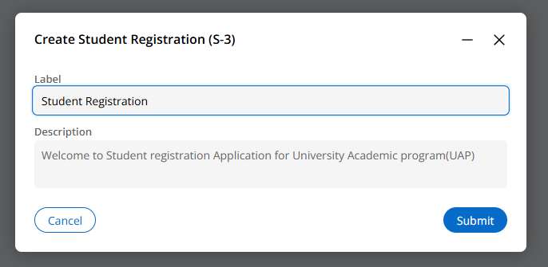
* **Workflow Stage:** Stage 1 — `CaseCreation`
* **Work Status:** `NEW`
* **Description:** Initiates the `Student Registration` case (`S-3`). Prompts the applicant or operator with a modal displaying the case label and welcome description (*"Welcome to Student registration Application for University Academic program (UAP)"*).
* **Pega Technical Details:** Invokes the `CreateForm_Default` flow and initial data transforms (`pyDefault`, `pySetFieldDefaults`) to initialize case properties and default urgency.

---

### Step 02: Eligibility Check Gateway
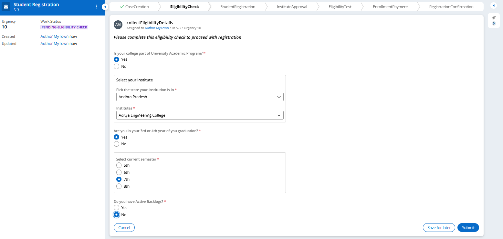
* **Workflow Stage:** Stage 2 — `EligibilityCheck`
* **Work Status:** `PENDING-ELIGIBILITY CHECK`
* **Description:** Acts as a pre-registration eligibility gatekeeper. Verifies whether the student's college is affiliated with UAP, allows selection of the State and affiliated Institute, confirms current academic standing (3rd or 4th year / semesters 5th–8th), and checks that the applicant has no active backlogs.
* **Pega Technical Details:** If an applicant indicates active backlogs or an unaffiliated college, business rules immediately halt registration and transition the case to the `Rejection due InEligibility` alternate stage.

---

### Step 03: Student Personal & Address Details
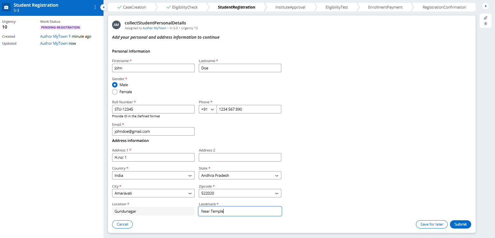
* **Workflow Stage:** Stage 3 — `StudentRegistration` (Step 1)
* **Work Status:** `PENDING-REGISTRATION`
* **Description:** Collects core student identity fields including First Name, Last Name, Gender, Roll Number (`STU-12345`), Phone Number (+91 format), and Email address. Features a dynamic cascading address interface (`Country` $\rightarrow$ `State` $\rightarrow$ `City` $\rightarrow$ `Zipcode`). When the student enters ZIP code `522020` and tabs out, Pega automatically retrieves and populates the Location (*Gundunagar*) and Landmark (*Near Temple*) fields.
* **Pega Technical Details:** Implements Edit Validate rules on Roll Number (`STU-XXXXX` regex pattern) and invokes data pages sourcing from `TSPO-FW-TSPP-Data-LocationAndLandmark` on ZIP tab-out.

---

### Step 04: Educational Qualifications & Document Uploads
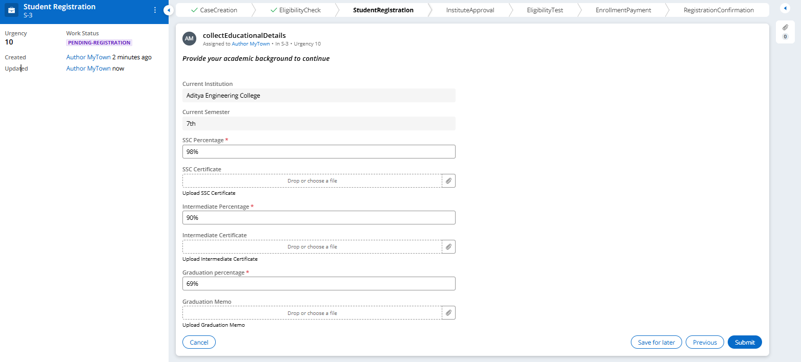
* **Workflow Stage:** Stage 3 — `StudentRegistration` (Step 2)
* **Work Status:** `PENDING-REGISTRATION`
* **Description:** Gathers prior academic track records. Displays the student's enrolled institute (*Aditya Engineering College*) and current semester (*7th*) as read-only context. Collects academic percentages for SSC (10th), Intermediate (12th), and Graduation (B.Tech). Integrates file attachment controls allowing students to upload digital copies of their SSC Certificate, Intermediate Certificate, and Graduation Grade Memo.
* **Pega Technical Details:** Configured with property validations (`CollectEducationalDetails`) enforcing percentage thresholds and multi-file attachment associations linked directly to the case work object.

---

### Step 05: Course Selection & Dynamic Pricing
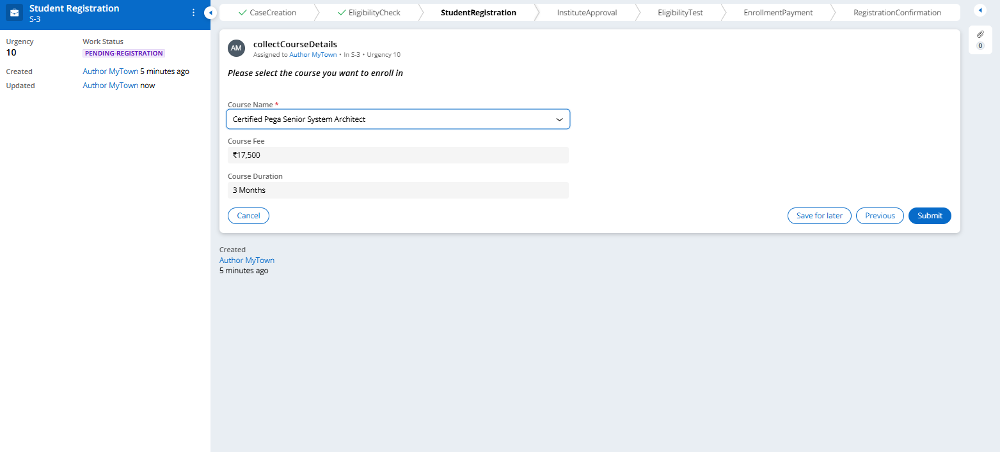
* **Workflow Stage:** Stage 3 — `StudentRegistration` (Step 3)
* **Work Status:** `PENDING-REGISTRATION`
* **Description:** Enables the applicant to choose their desired certification specialization (e.g., *Certified Pega Senior System Architect*). Upon selection, the application dynamically displays the associated Course Fee (*₹17,500*) and Course Duration (*3 Months*).
* **Pega Technical Details:** Utilizes dynamic field behavior and data transform rules to calculate and populate fee parameters directly into the case data model.

---

### Step 06: Consolidated Application Review
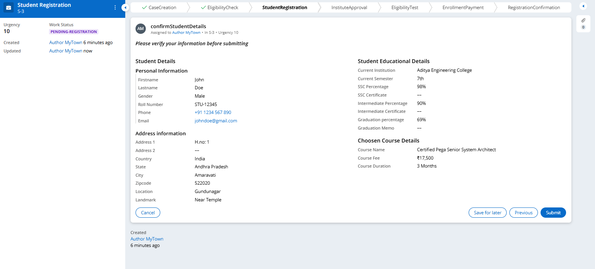
* **Workflow Stage:** Stage 3 — `StudentRegistration` (Step 4)
* **Work Status:** `PENDING-REGISTRATION`
* **Description:** Provides a complete read-only summary screen consolidating all previously entered information—Personal Information, Address Data, Academic Percentages, Uploaded Documents, and Selected Course Details—giving the applicant a comprehensive review prior to submitting.
* **Pega Technical Details:** Uses structured layout sections referencing the student data model to render a unified verification view without redundant database queries.

---

### Step 07: Institute Verification & SLA Policy Notice
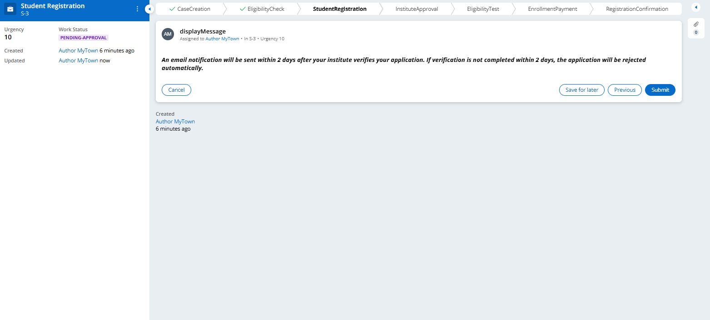
* **Workflow Stage:** Stage 3 — `StudentRegistration` (Step 5)
* **Work Status:** `PENDING-APPROVAL`
* **Description:** Advises the applicant that their application has been successfully captured and routed to their institute authority for verification. Crucially communicates the Service Level Agreement (SLA) policy: verification must be completed within 2 days, after which the application is automatically rejected.
* **Pega Technical Details:** Updates work status to `PENDING-APPROVAL` and initiates the background Service Level Agreement timer governing the subsequent approval stage.

---

### Step 08: Dynamic Routing & Work Queue Assignment
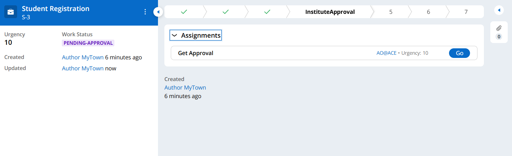
* **Workflow Stage:** Stage 4 — `InstituteApproval`
* **Work Status:** `PENDING-APPROVAL`
* **Description:** Demonstrates Pega's dynamic assignment routing. Based on the college selected by the student (*Aditya Engineering College*), the case assignment `Get Approval` is routed specifically to that institution's Academic Officer work queue/operator (`AO@ACE`, Urgency: 10).
* **Pega Technical Details:** Uses dynamic routing logic referencing `CollegeLocation` data tables to route assignments to institutional operator IDs rather than static user queues.

---

### Step 09: Academic Officer Review & Approval Decision
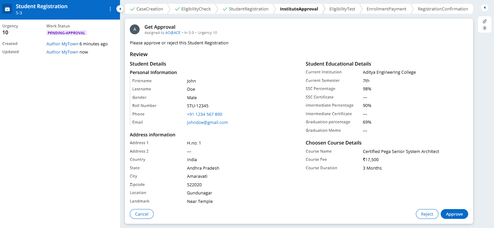
* **Workflow Stage:** Stage 4 — `InstituteApproval`
* **Work Status:** `PENDING-APPROVAL`
* **Description:** The Academic Officer portal screen where college authorities review the student's credentials, certificates, and course request. The officer evaluates the application and can either click `Approve` to advance the case or `Reject` to route to an application rejection stage.
* **Pega Technical Details:** Flow action decision step that evaluates decision branching (`Approve` transitions to `EligibilityTest`; `Reject` transitions to `ApplicationRejection`).

---

### Step 10: Pre-Assessment Instructions
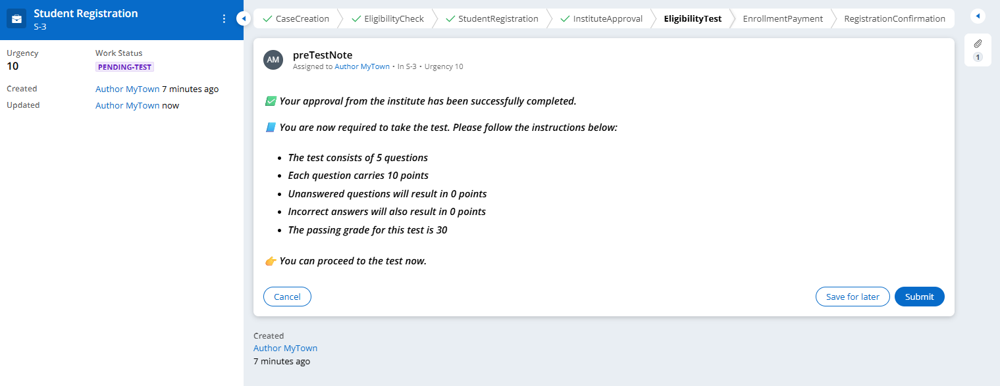
* **Workflow Stage:** Stage 5 — `EligibilityTest` (Pre-Test Step)
* **Work Status:** `PENDING-TEST`
* **Description:** Following institutional approval, the student receives notice that institute verification succeeded, accompanied by detailed rules for the mandatory eligibility test (5 questions, 10 points each, 30 passing score threshold, 0 points for unanswered/incorrect answers).
* **Pega Technical Details:** Informs the user before spinning off the assessment sub-case, preparing the parent case to enter an awaiting state.

---

### Step 11: Online Eligibility Assessment Child Case
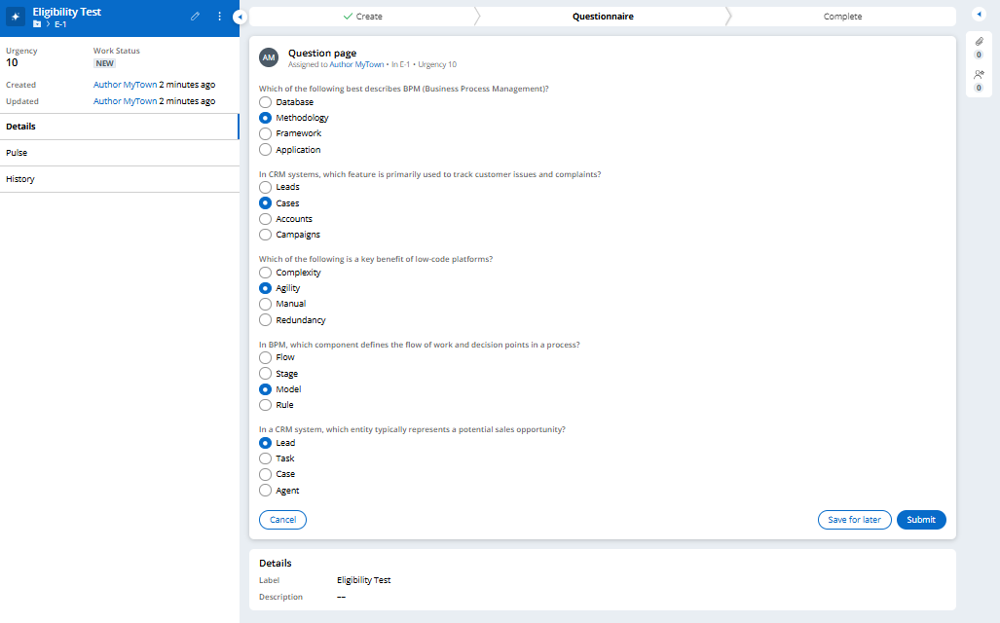
* **Workflow Stage:** Stage 5 — `EligibilityTest` (Child Case Execution)
* **Work Status:** `NEW` (Child Case `E-1`)
* **Description:** Demonstrates Pega parent/child case architecture. The parent case spins off a child case `EligibilityTest` (`E-1`) and enters a Wait Shape. The child case presents an interactive 5-question low-code assessment on BPM concepts, CRM cases, low-code agility, process models, and sales leads.
* **Pega Technical Details:** Child case `TSPO-FW-TSPP-Work-EligibilityTest` executes its `Questionnaire` stage while the parent case `StudentRegistration` remains in a synchronized Wait Shape (`waitForTestCompletion`).

---

### Step 12: Automated Scoring Feedback & Qualification
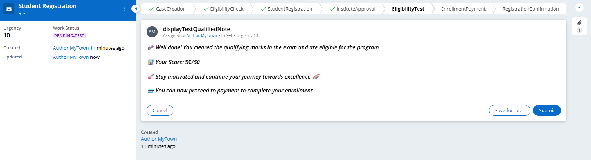
* **Workflow Stage:** Stage 5 — `EligibilityTest` (Evaluation & Results)
* **Work Status:** `PENDING-TEST`
* **Description:** Upon completion of the child case, automated evaluation rules calculate the score and return it to the parent case. The screen displays a celebratory clearance notice showing the final score (*50/50*) and authorization to proceed to payment.
* **Pega Technical Details:** Evaluated using When rules (`C1` through `C5`) and Data Transform `CalculateScore`, which maps the score to `pyWorkCover.Score`. A Decision Shape evaluates `Score >= 30` before presenting the clearance view.

---

### Step 13: Enrollment Fee Payment Processing
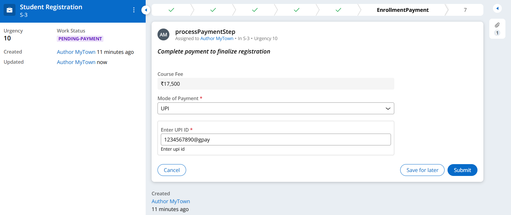
* **Workflow Stage:** Stage 6 — `EnrollmentPayment`
* **Work Status:** `PENDING-PAYMENT`
* **Description:** Handles course enrollment fee collection. Displays the inherited fee (*₹17,500*), lets the student choose between UPI and Credit/Debit Card modes, and validates payment inputs (UPI ID regex e.g. `1234567890@gpay` and Card CVV/Number).
* **Pega Technical Details:** Executes savable data pages and Data Transforms (`GeneratePaymentID`, `SPDT`) to generate compound payment references (`S-3-STU-12345`) and commit records to `TSPO-FW-TSPP-Data-PaymentDetails`.

---

### Step 14: Registration Success & Onboarding Notice
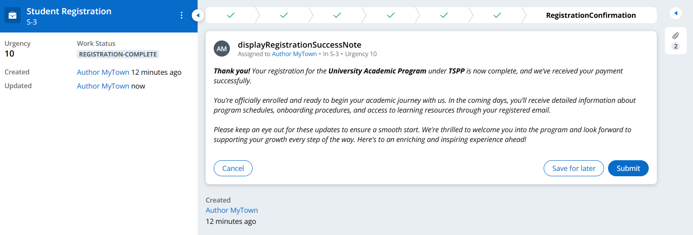
* **Workflow Stage:** Stage 7 — `RegistrationConfirmation`
* **Work Status:** `REGISTRATION-COMPLETE`
* **Description:** Final confirmation screen notifying the student that their registration and payment for the University Academic Program under TSPP has been completed successfully. Outlines subsequent onboarding schedules and orientation materials dispatched to their registered email.
* **Pega Technical Details:** Transitions case work status to `REGISTRATION-COMPLETE` and triggers correspondence automation.

---

### Step 15: Resolved Case Lifecycle
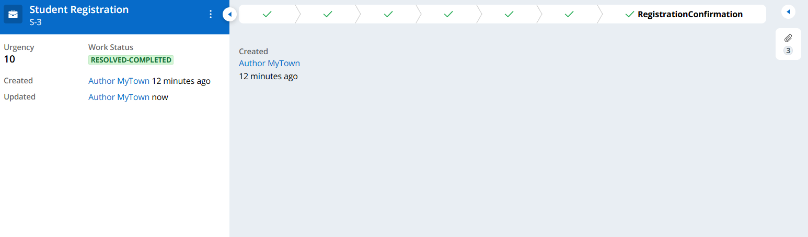
* **Workflow Stage:** Case Completion
* **Work Status:** `RESOLVED-COMPLETED`
* **Description:** Displays the fully completed case lifecycle with all 7 stages marked with green checkmarks (`CaseCreation`, `EligibilityCheck`, `StudentRegistration`, `InstituteApproval`, `EligibilityTest`, `EnrollmentPayment`, and `RegistrationConfirmation`), with work status formally set to `RESOLVED-COMPLETED`.
* **Pega Technical Details:** Final resolution step setting standard Pega resolution status (`Resolved-Completed`) and closing open work assignments.

---

[← Back to Main Repository](../../README.md)
